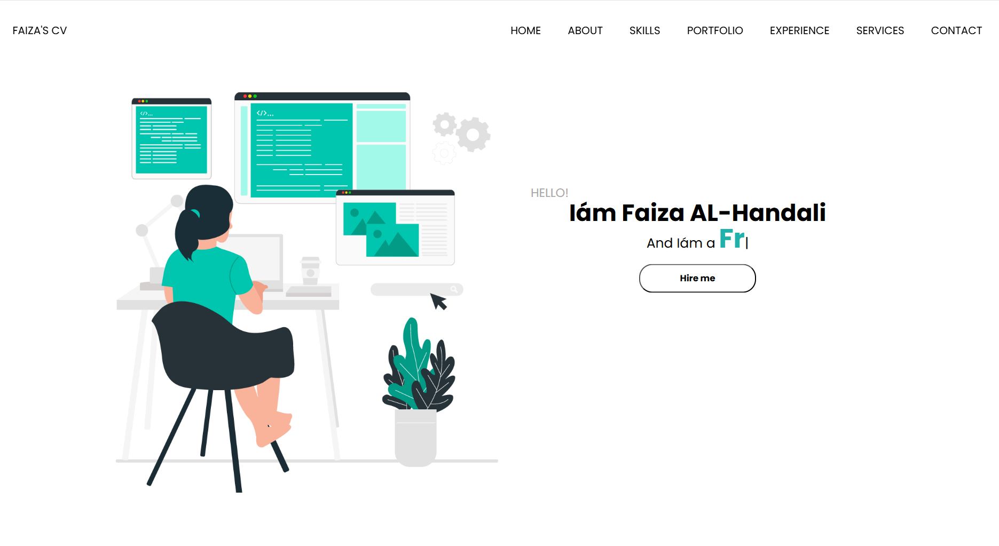

# 🌐 Personal Profile & CV Website

A clean and interactive **personal profile website** designed to showcase skills, experience, and achievements in a simple yet visually appealing way. Built with **HTML, CSS, JavaScript, and TypeScript**, this site provides a modern online CV that is easy to navigate and responsive on all devices.

---

## 🌟 Features

* 👤 **Personal Profile Section**
* 🛠️ **Skills Highlight Section**
* 📄 **Experience & Achievements Display**
* 📱 **Responsive design** for all screen sizes
* ⚡ **Interactive elements** powered by JavaScript & TypeScript
* 🎨 Smooth, minimal, and professional UI

---

## 💻 Technologies Used

| Technology           | Purpose                  |
| -------------------- | ------------------------ |
| **HTML5**            | Website structure        |
| **CSS3**             | Styling & layout         |
| **JavaScript (ES6)** | Interactivity            |
| **TypeScript**       | Typed, scalable codebase |

---

## 🚀 Live Demo

👉 **Project Link:** [https://github.com/faiza-code/Profile-s-Website](https://github.com/faiza-code/Profile-s-Website)

---

## 📂 Project Structure

```
📦 Profile-Website
 ┣ 📜 index.html
 ┣ 📂 css/
 ┣ 📂 js/
 ┣ 📂 ts/
 ┣ 📂 images/
 ┗ 📜 README.md
```

---

## 📸 Screenshots

```

```

---

## ▶️ How It Works

1. HTML builds the structure of your CV sections
2. CSS styles the layout and enhances professional appearance
3. JavaScript adds animations and interactivity
4. TypeScript ensures cleaner, safer, and scalable code
5. Responsive design adjusts the layout automatically for mobile, tablet, and desktop

---

## 🧠 What I Learned

* Structuring a complete personal website
* Building scalable scripts using TypeScript
* Using CSS to craft clean and modern UI
* Enhancing UX with JavaScript interactivity
* Organizing a multi-file front-end project

---

## 📌 Future Improvements

* 🌙 Add a dark/light mode toggle
* 💼 Add downloadable PDF CV
* ✉️ Add a working contact form
* 🌟 Add animations with libraries like AOS or GSAP

---

## ❤️ Author

**Faiza Alhandali**
A passionate and motivated developer building clean, simple, and interactive personal web projects.

---
